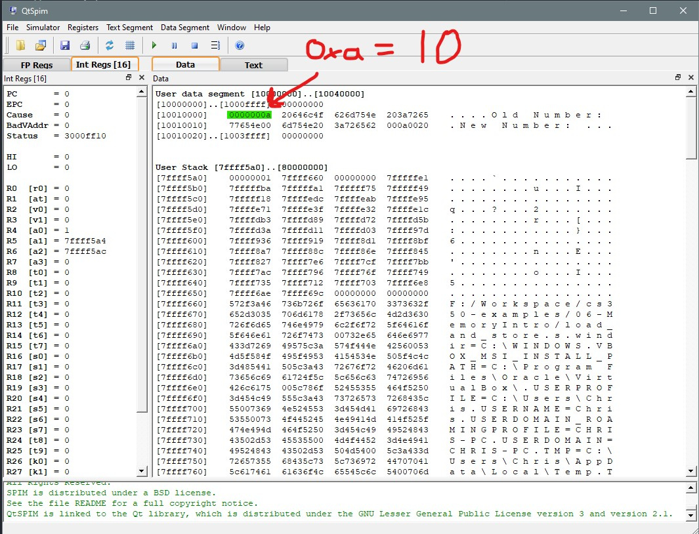

Write a program that starts with a stored integer 10 in memory. Print that
integer as an old integer, save 20 to that spot in memory, and then print 20
as the new integer.

Example Output:
```
Old Number: 10
New Number: 20
```

Data Segment Before Execution:


Data Segment After Execution:
